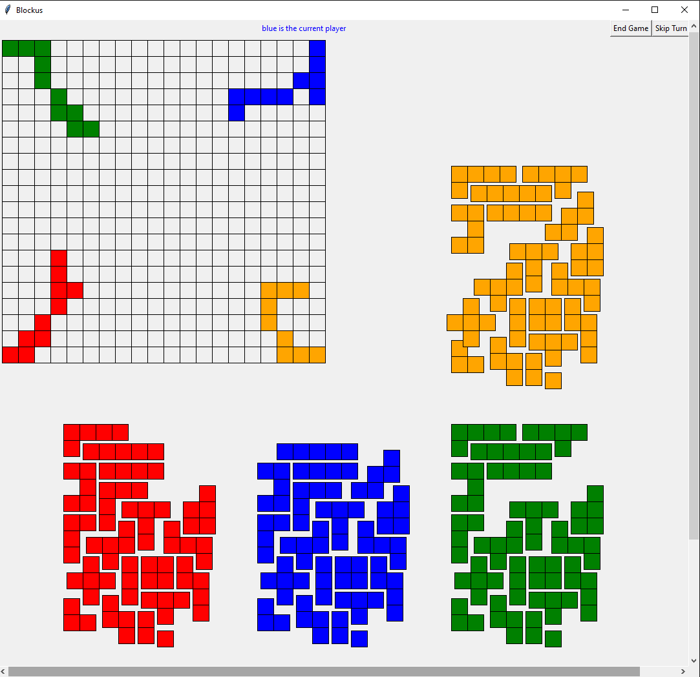

A python 3 implementation of the classic game Blokus with local multiplayer support for 2-4 players. The ultimate goal
is to get this to support online multiplayer so I can play with my friends.

<b> Setup </b>  
Execute main.py. This is built with the standard library so setup is nice and easy.  
Then select the number of players as prompted.  This only impacts the scoring methodology as described in the rules.
  

<b> Play </b>  
The current player is denoted by the turn indicator in the top-center of the screen.  
The "End Game" button scores the game and announces the winner.   
The "Skip Turn" allows gameplay to continue in the event a player determines they have no valid move to make.  
Pieces can be rotated and flipped using the arrow keys.
  

<b> Rules </b>  
This implementation adheres to the rules described in docs/blokus_instructions with two exceptions:  
1: Scoring methodology is always "basic". "Advanced" scoring is not currently supported.  
2: In 3-player games green is always considered the shared color for scoring purposes. Their points are discarded.
  

<b> Bugs </b>  
A playing piece will not properly snap to the board when the cursor is straddling the boundary between 
two of the board squares. Attempting to place the piece in such a state is interpreted as putting the piece down
rather than the piece being played.
  

<b> Planned Improvements </b>
- Online multiplayer: Probably a client/host setup with multithreading to allow a heartbeat/disconnect handling.
- Blokus variants: Add support for the other official rule sets and different boards.

